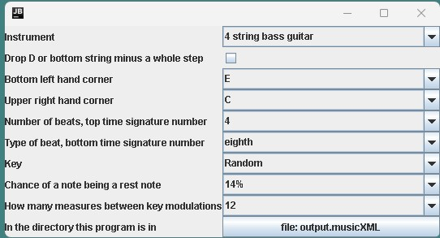

Designed to train sight reading and fretboard knowledge, with some high and low bumper options so if you want to focus on cowboy chord position you can do that, and if you want to focus up the neck without the cowboy chord position you can do that too, with anything in between

Generates random notes from a rectangle of a 4 string bass guitar in standard tuning from the bottom left corner to the top right corner, by scale degree, with options for a single key per piece or random modulation every so often.

Outputs to a file called output.musicXML in the directory the .jar file is in.I use Crescendo, I forget why, but MuseScore works too. In Crescendo the option is in the right click menu in Staff Spacing, and 0.16 lines them up perfectly, there's some option in MuseScore too that scoots the staves closer together so it's one united staff

Guitar, violin, piano, all possible when I have time. I'm considering rebooting this in MIDI, in converters I started the integer key array  to scale degree conversion but it's not perfect yet. I prefer zero indexed arrays, and I think Nashville numbers should be zero indexed, so everything is mod 7 rather than this summing to nine lets add a mod and a shift, or a shift and then a mod, it's adding a step to the equation. Algorithmic music generation is going to be tons tons easier with zero indexed Nashville numbers, maybe I'll build a Nashville to zero indexed converter

The first four measures are drones so you have four chances to sync your metronome, I use an old Casio keyboard for drums and a Boss DB-90 for counting, at the same time

If you're reading this and like my program, I'm open to professional networking opportunities, resume: Music, programming, CompSci degree

Suggestions and feedback are welcome, Other instruments, cadence rhythm and modal notewise bitmasks are the two off the top of my head

